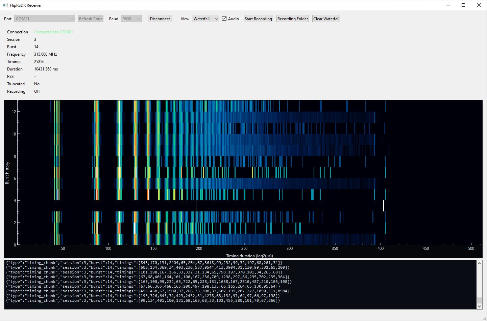

# FlipRSDR

FlipRSDR is a Flipper Zero external app that captures raw demodulated Sub-GHz pulse/gap timings and streams them to a PC over USB CDC or BLE serial. It is intentionally focused on pulse timing fidelity rather than protocol decoding.

## What it does

- Captures ordered pulse/gap durations in microseconds using the firmware async Sub-GHz receive path
- Detects burst start, burst continuation, and burst end from gap timing and idle timeout
- Preserves the full timing burst locally in buffered modes, including truncation and overflow flags
- Streams JSON lines that a future PC tool can use for replay, visualization, or audio-style rendering
- Supports USB CDC on dual-CDC channel `1` and BLE serial

## Main flow

- `Start Capture`
  - `OK` starts or stops listening
  - `Left` clears the buffered burst
  - `Right` sends the buffered burst
  - `Back` leaves the screen and stops capture
- `Settings`
  - Frequency preset
  - Frequency fine-tune offset
  - Transport
  - Streaming mode
  - Auto-send after burst complete
  - Include RSSI
  - Include timestamp
  - Max pulse count
  - Capture timeout
  - Burst-end gap threshold
  - Debug send action
- `About`

## Streaming format

Live modes emit JSON lines like:

```json
{"type":"burst_start","session":1,"burst":1,"freq":433920000,"first_level":1,"timestamp":12345}
{"type":"timing_chunk","session":1,"burst":1,"timings":[350,1050,350,350,1050,350]}
{"type":"burst_end","session":1,"burst":1,"count":123,"rssi":-58.0,"truncated":false}
```

Buffered send emits:

```json
{"type":"burst_capture","session":1,"burst":1,"freq":433920000,"first_level":1,"timestamp":12345,"timings":[...],"count":123,"rssi":-58.0,"truncated":false}
```

`first_level` is included so the PC side can reconstruct the exact pulse/gap ordering even if the first received interval is a gap.

## File structure

- `fliprsdr.c`
  - App allocation, view dispatcher, scene manager, and shared refresh helpers
- `fliprsdr.h`
  - Shared enums, constants, settings, burst, and snapshot structs
- `fliprsdr_app.h`
  - Internal app struct, view ids, and custom events
- `settings.c` / `settings.h`
  - Persistent settings using `saved_struct`
- `burst_buffer.c` / `burst_buffer.h`
  - Fixed-capacity burst storage with truncation tracking
- `capture.c` / `capture.h`
  - Raw async Sub-GHz receive worker and burst assembly
- `transport.c` / `transport.h`
  - Shared transport thread and backend selection
- `transport_usb.c`
  - USB CDC transport backend
- `transport_ble.c`
  - BLE serial transport backend
- `protocol.c` / `protocol.h`
  - JSON formatting and buffered capture serialization
- `views/capture_view.c` / `views/capture_view.h`
  - Custom capture status screen
- `scenes/`
  - Menu, capture, settings, and about scenes
- `application.fam`
  - Flipper manifest
- `build.ps1`
  - Sync-and-build helper for a local firmware checkout

## Firmware API assumptions

- Raw receive uses `furi_hal_subghz_start_async_rx(...)`
- The receive preset uses `subghz_device_cc1101_preset_ook_270khz_async_regs`
- USB streaming uses:
  - `furi_hal_usb_set_config(&usb_cdc_dual, NULL)`
  - `furi_hal_cdc_set_callbacks(...)`
  - `furi_hal_cdc_send(...)`
- BLE streaming uses:
  - `bt_profile_start(..., ble_profile_serial, NULL)`
  - `ble_profile_serial_set_event_callback(...)`
  - `ble_profile_serial_tx(...)`

## Notes and TODOs

- The app currently uses the public async raw receive API directly and does not depend on protocol decode paths.
- Buffered modes intentionally stop after one completed burst so the last burst can be preserved exactly and resent without being overwritten. This matches the v1 priority of “one complete burst at a time is acceptable”.
- `TODO`: the OOK raw receive preset may need tuning per target signal family or future firmware changes.
- `TODO`: USB transport currently assumes dual CDC channel `1` is the safest user-facing serial endpoint.
- `TODO`: BLE transport restores the default serial profile on exit because the public API does not expose the previously active profile template.

## Building

Default:

```powershell
.\build.ps1
```

Preview only:

```powershell
.\build.ps1 -PreviewSync
```

Skip build after sync:

```powershell
.\build.ps1 -SkipBuild
```

## PC receiver

The Windows desktop companion app lives under `receiver/` and is called `FlipRSDR Receiver`.

- Live serial ingest from the Flipper CDC stream
- Waveform view for the current pulse train
- Waterfall view using log-duration bins with SDR-style coloring
- Optional recording of completed bursts to JSONL
- Optional audible playback of completed bursts
- Automatic port refresh while disconnected, plus last-port recall on restart



Build the Windows executable with:

```powershell
.\build_receiver.ps1
```

The build script writes the final executable to:

```text
build\FlipRSDR Receiver.exe
```
